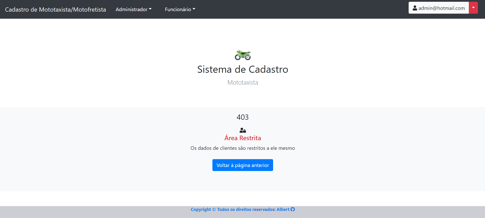
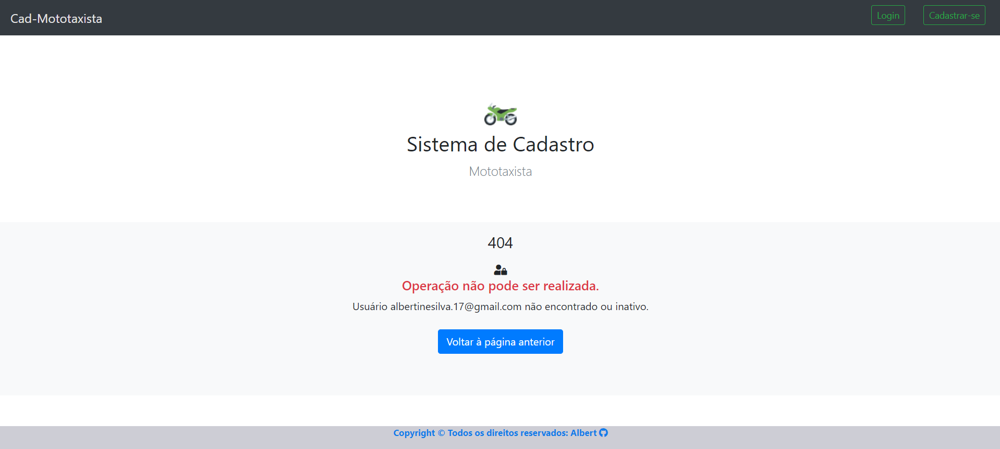

<h2 align="center">CAD-MOTOTAXISTA - Documentação Técnica</h2>

**Figura 1 – Mensagem de Violação de Integridade (Erro HTTP 400).**  
A imagem demonstra o retorno do servidor quando uma solicitação enviada pelo cliente viola regras de consistência ou restrições estabelecidas no backend, resultando em um erro **HTTP 400 – Bad Request**, indicando que a requisição é inválida para processamento.  
  
**Fonte: Sistema CADMOTOTAXISTA (2025).**

---

**Figura 2 – Mensagem de Área Restrita ao acessar recurso protegido (Erro HTTP 403).**  
Esta evidência representa o bloqueio de acesso a recursos protegidos quando o usuário não possui as permissões necessárias. Nesse caso, o sistema retorna **HTTP 403 – Forbidden**, indicando que a requisição foi compreendida, porém não está autorizada.  
  
**Fonte: Sistema CADMOTOTAXISTA (2025).**

---

**Figura 3 – Usuário inativo ou não encontrado (Erro HTTP 404).**  
A imagem evidencia o comportamento do sistema ao buscar informações de um usuário inexistente ou inativo. O servidor, ao não localizar o recurso solicitado, responde com **HTTP 404 – Not Found**, sinalizando ausência ou indisponibilidade do recurso.  
  
**Fonte: Sistema CADMOTOTAXISTA (2025).**

---
